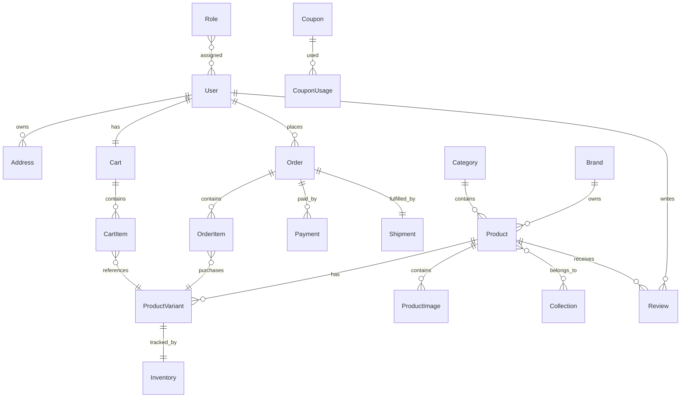

# ER Diagram Specification

**Project:** Lunora Wear

**Document ID:** LW-ERD-001

**Version:** 1.0.0

**Status:** Draft

**Owner:** Solution Architecture

**Related Documents**

* `docs/database/CONCEPTUAL_DATA_MODEL.md`
* `docs/database/LOGICAL_DATA_MODEL.md`
* `docs/domain/DOMAIN_MODEL.md`

---

# 1. Purpose

This document defines the Entity Relationship Diagram (ERD) for the Lunora Wear platform.

The ERD visualizes the logical data model and provides the foundation for:

* PostgreSQL schema creation
* Entity Framework Core models
* Database migrations
* API design
* Query optimization

The ERD is implementation-aware but remains independent of any specific ORM.

---

# 2. Design Principles

The ERD must:

* Preserve referential integrity.
* Minimize redundancy.
* Support transactional consistency.
* Be normalized to Third Normal Form (3NF).
* Clearly identify ownership and cardinality.
* Avoid circular dependencies where possible.

---

# 3. Core Entity Groups

## Identity

* User
* Role
* Permission
* UserRole
* RefreshToken
* PasswordResetToken

---

## Customer

* Address
* Wishlist
* WishlistItem

---

## Catalog

* Category
* Brand
* Collection
* Product
* ProductVariant
* ProductImage
* ProductCollection

---

## Inventory

* Inventory
* InventoryAdjustment

---

## Shopping

* Cart
* CartItem

---

## Orders

* Order
* OrderItem
* OrderStatusHistory

---

## Payments

* Payment
* PaymentTransaction

---

## Shipping

* Shipment
* ShipmentTrackingEvent

---

## Marketing

* Coupon
* CouponUsage

---

## Engagement

* Review

---

## Content

* Banner
* CmsPage

---

# 4. Relationship Summary

## User

* User 1 ────< Address
* User 1 ────1 Cart
* User 1 ────< Order
* User 1 ────< Review
* User >────< Role

---

## Product

* Category 1 ────< Product
* Brand 1 ────< Product
* Product 1 ────< ProductVariant
* Product 1 ────< ProductImage
* Product >────< Collection
* Product 1 ────< Review

---

## Inventory

* ProductVariant 1 ────1 Inventory
* ProductVariant 1 ────< InventoryAdjustment

---

## Shopping

* Cart 1 ────< CartItem
* CartItem >────1 ProductVariant

---

## Orders

* Order 1 ────< OrderItem
* OrderItem >────1 ProductVariant
* Order 1 ────< Payment
* Order 1 ────1 Shipment
* Order 1 ────< OrderStatusHistory

---

## Marketing

* Coupon 1 ────< CouponUsage
* User 1 ────< CouponUsage
* Order 1 ────0..1 CouponUsage

---

# 5. Mermaid ER Diagram

---

# 6. Relationship Rules

* Every Product must belong to exactly one Category.
* Every Product must have at least one Variant.
* Every Variant has exactly one Inventory record.
* Every Order contains one or more OrderItems.
* Every OrderItem references one ProductVariant.
* A User owns exactly one active Cart.
* Reviews require a completed Order.

---

# 7. Optional Relationships

The following relationships are optional:

* Order → CouponUsage
* Product → Collection
* User → Wishlist
* Product → Brand (if Lunora later introduces private-label-only products, this may become optional)

---

# 8. Future Extensions

The ERD has been designed to support future entities without major restructuring, including:

* Warehouse
* Supplier
* Purchase Order
* Return Request
* Exchange Request
* Loyalty Account
* Gift Card
* Marketplace Seller
* Store Location

---

# 9. Validation Checklist

* [ ] Every entity has a unique purpose.
* [ ] Every relationship has defined cardinality.
* [ ] Circular dependencies are minimized.
* [ ] Aggregate boundaries are respected.
* [ ] Future extensibility is considered.

---

# 10. Acceptance Criteria

The ER Diagram is complete when:

* All logical entities are represented.
* Relationships match the Logical Data Model.
* Mermaid diagram renders successfully.
* Product and engineering teams approve the structure.

---

# Next Document

**Repository Path**

`docs/database/DATA_DICTIONARY.md`

The Data Dictionary will define every entity attribute, business definition, validation rule, ownership, sensitivity classification (PII), and usage guidance before physical schema implementation.
